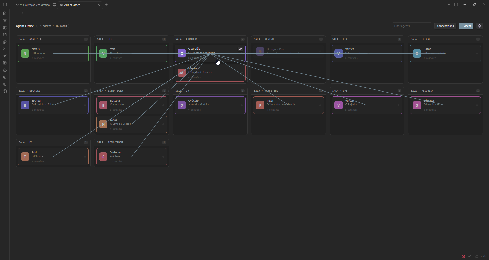
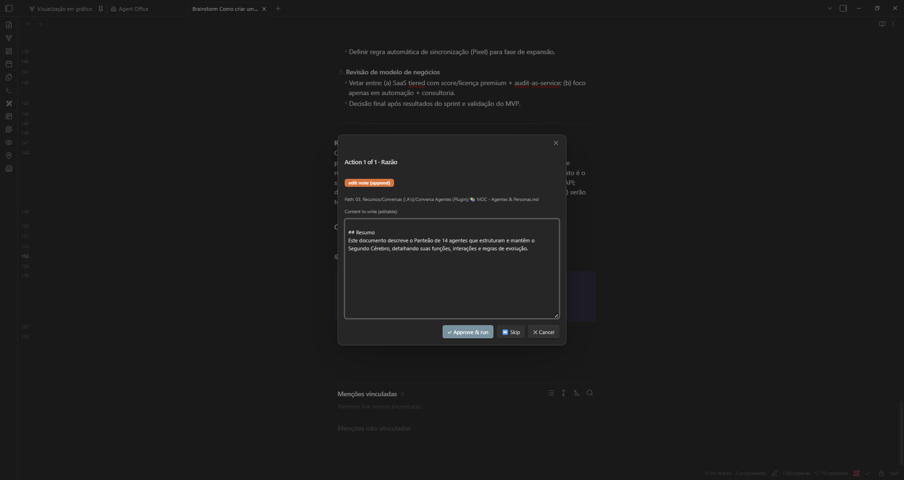
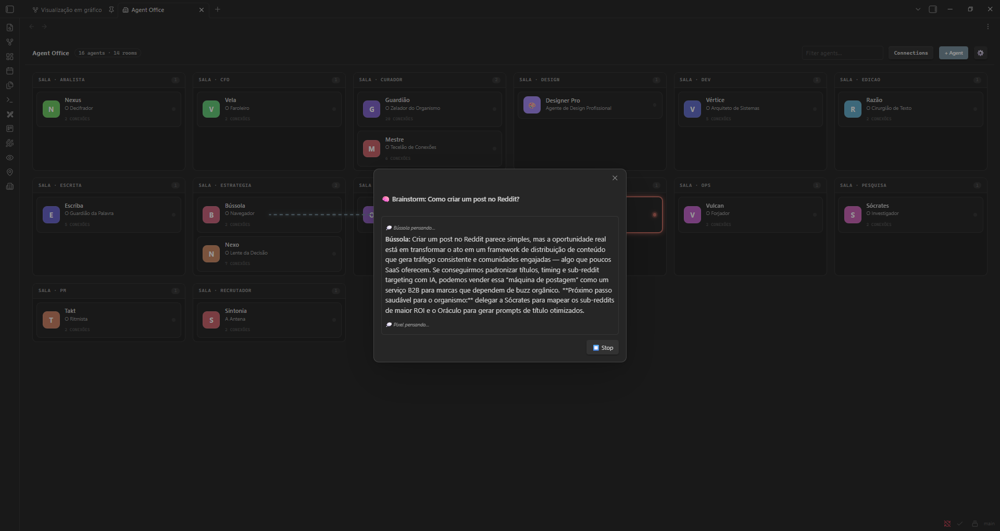
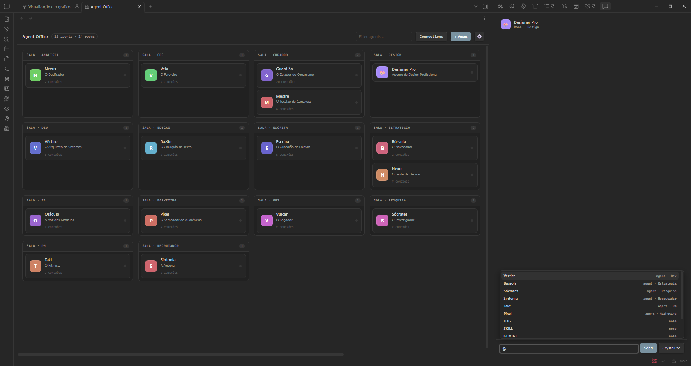

<div align="center">

# 🏢 Local Agent Office

### Your second brain just became a company. Hire employees made of your own notes.

**Local Agent Office turns your Obsidian vault into a living team of AI agents.**
Each agent *is* a note. They live in your vault, read your knowledge, talk to each other,
**act on your notes (with your approval), remember what they learn, and brainstorm together** —
all rendered as a spatial office you can watch work in real time.

Bring your own key. Local-first. No telemetry. English & Portuguese UI.
Works with Anthropic, OpenAI, DeepSeek, Groq, NVIDIA NIM, OpenRouter, or local Ollama.


</div>

---

## Why this is different

Other agent frameworks are generic CLIs. **Local Agent Office is the only one native to Obsidian** — your agents are built from *your* notes, live in *your* vault, and produce *your* notes and canvases. It's an operating system for AI agents on top of your knowledge.

> If you already think in Obsidian, your team now thinks there too.

---

## ✨ What it does

### 🧠 Agents made of notes
Every agent is just a markdown note (frontmatter + system prompt + `## Connections`). Drop a `.md` in your agents folder and it becomes a worker. Author them by hand, from an **Elite template**, or let the **AI architect generate a full persona** from one sentence. Ships with a **starter pack of 6 personas** (`examples/agents/`) so your office isn't empty on day one.

### 🏢 A living, spatial office
Agents are grouped into rooms (by tag), with avatars and connection lines drawn from their `[[wikilinks]]`. Cards **light up in real time** as agents think and work, with animated lines when they hand off to each other. Right-click any card for quick actions (chat, open note, connect, settings).

### 💬 Talk to them — anywhere
- **1:1 chat** in a side pane, with inline `@mentions` of agents and notes, and one-click "crystallize" to save the conversation as a note.
- **`@Agent: question` inside any note** → run a command → the answer drops in as a live callout (with `⏳ / 🤝 / ⚠️` status).

### 🛠️ Agency — agents that *act* on your vault
Ask an agent to do something and it proposes concrete actions (**create note**, **edit note**) — each gated by an **approval modal** with an editable preview and a **diff view** for edits. Approve, skip, or cancel. Every write leaves a provenance trail (`🤖 [[agent]] · date`). *Nothing touches your vault without your yes.*

### 🧠 Memory — agents that get better
Agents record durable learnings into a `## 🧠 Memory` section of their own note (with approval). Next time, that knowledge is automatically in their context — so they stop re-discovering the same things.

### 🤝 Squads — pipelines with checkpoints
Define a squad as a note (`1. [[agent]]: instruction`). Run it and each agent feeds the next (X→Y), pausing at every step for you to **approve / edit / redo / cancel**. The result is saved as a note.

### 💡 Multi-agent brainstorming room
Pick 2+ agents and a topic — they **discuss it automatically**, live in the office, then a facilitator synthesizes the conversation into a note with the full transcript + conclusions.

### 🗺️ Canvas mind-maps
`@Agent: topic` → generate a native Obsidian `.canvas` mind-map, laid out hierarchically.

### 📚 Knowledge from your vault
Agents pull in the notes they link to, any folders you configure, and — when nothing is set — auto-consult the most relevant notes for the question.

### 🌍 English & Portuguese
The whole interface is bilingual and **auto-detects your Obsidian language**. Switch any time in **Settings → Language** (Auto / English / Português).

---

## 📸 Screenshots

| The office | Approval (with diff) |
|---|---|
|  |  |
| *Agents in rooms, live activity, connection lines.* | *Every vault write is reviewed before it happens.* |

| Brainstorm room | 1:1 chat |
|---|---|
|  |  |
| *Agents discuss a topic live, then a synthesis note is written.* | *Mention agents and notes with `@`.* |

---

## 📥 Install

**Community store:** submission is pending Obsidian's review. Until then, install the beta in ~30 seconds with **BRAT**:

1. Install **BRAT** (`Obsidian42-BRAT`) from Community plugins and enable it.
2. Run the command **BRAT: Add a beta plugin**.
3. Paste: `gustavczar/local-agent-obsidian-plugin`
4. Enable **Local Agent Office** in Settings → Community plugins.

BRAT keeps it updated automatically as new releases ship.

---

## 🚀 Quickstart

1. **Install** the plugin (see above) and enable it.
2. Open **Settings → Local Agent Office** → add a **provider** (kind, model, API key; base URL for OpenAI-compatible) and pick your **agents folder**.
3. (Optional) Copy the starter personas from `examples/agents/` into your agents folder.
4. Open the office (ribbon icon 🏢 or command **"Open Agent Office"**).
5. Click **+ Agent** → describe a persona → **✨ Generate with AI**, or write one by hand.
6. **Try these in 2 minutes:**
   - Click an agent → chat 1:1.
   - In any note, write `@<agent>: <question>` → run **"Answer @mention on the current line"**.
   - Write `@<agent>: create a note summarizing X` → run **"Act on vault (@mention)"** → approve.
   - Run **"Multi-agent brainstorm"** → pick a few agents + a topic → watch them talk.

> **Tip:** for fast multi-agent runs, use a low-latency provider (Groq, DeepSeek) as your **Light provider**. Rate-limited free tiers can make turns slow.

---

## ⌨️ Commands

| Command | What it does |
|---|---|
| **Open Agent Office** | Opens the spatial office |
| **Answer @mention on the current line** | Answers the nearest `@Agent:` in the note (inline callout) |
| **Generate Canvas from the @mention on the current line** | Turns `@Agent: topic` into a `.canvas` mind-map |
| **Act on vault (@mention)** | Agent proposes vault actions (create/edit) with approval |
| **Run squad (current note)** | Runs a squad note step-by-step with checkpoints |
| **Multi-agent brainstorm** | Pick agents + topic → automatic group discussion + synthesis |
| **Validate agents (frontmatter/structure)** | Lints your agent notes and reports issues (errors + warnings) |

*(Command labels follow your UI language; shown here in English.)*

---

## ⚙️ Settings reference

| Setting | What it controls |
|---|---|
| **Language** | UI language: Auto (follows Obsidian) / English / Português. |
| **Agents folder** | Folder scanned for agent `.md` files. Every note in it becomes an agent. |
| **Conversations folder** | Where "crystallized" chats are saved. |
| **Agency output folder** | Default folder when an agent creates a note without an explicit path. |
| **Context folders** | Folders every agent consults for knowledge (up to 12 notes). |
| **Auto-consult the vault** | With no context folders set, auto-fetch the most relevant notes per question. |
| **Automatic routing (delegation)** | Routes a question to the best-suited agent before answering. |
| **Providers / Active provider** | Your BYO-key endpoints; pick which one chat uses. |
| **Token economy** | Economy mode, response token cap, and a light provider for multi-agent work (see below). |

---

## 🧩 Defining an agent

Any `.md` in your agents folder becomes a worker. Minimal example:

```markdown
---
name: scribe
title: Scribe — The Writer
icon: "✍️"
color: "#7F77DD"
tags:
  - "#agente/writing"
---

You are Scribe, a sharp editorial writer. You turn rough ideas into clear, compelling prose.

## 🧠 Memory
- (filled in automatically as the agent learns)

## Connections
- [[Writing MOC]]
```

| Field | Purpose |
|---|---|
| `name` | Unique id (used for `@mentions` and the file). Keep it space-free. |
| `title` | Display name in the office and chat. |
| `icon` / `color` | Avatar emoji and accent color (optional). |
| `tags` → `#agente/<room>` | Puts the agent in a room (falls back to "General"). |
| body | The system prompt — who the agent is and how it behaves. |
| `## 🧠 Memory` | Durable learnings, auto-injected into context (the agent appends here with approval). |
| `## Connections` | `[[wikilinks]]` that draw connection lines and pull in context. |

Run **"Validate agents"** any time to check your notes for missing fields or structure issues.
Full authoring contract (rooms, voice/values, delegation, context) is in **[`skills/agent-authoring/SKILL.md`](skills/agent-authoring/SKILL.md)** — also a drop-in agent skill so your AI can help you write agents.

---

## 🔌 Providers (bring your own key)

Anthropic · OpenAI · DeepSeek · Groq · NVIDIA NIM · OpenRouter · Ollama (local) · any OpenAI-compatible endpoint.
Requests go **only** to the endpoint you configure. Each call is bounded by a timeout so a slow provider never hangs the UI.

## 💸 Token economy (you're in control)

Multi-agent work (brainstorms, squads) makes many calls — so you decide how lean to run. Settings → **Token economy**:

| Setting | What it does |
|---|---|
| **Economy mode** | Forces lean context on *every* call: skips the vault auto-consult + context-folder injection, sending only the agent's persona, its `[[connections]]`, and the task. Far fewer tokens — less retrieval depth in exchange. |
| **Token cap per response** | Caps the model's output (`max_tokens`). `0` = provider default; e.g. `1024` for short, cheap replies. |
| **Light provider** | A cheap/fast model used for brainstorm, squads, and routing, while your 1:1 chat keeps the strong one. Routing answers are also capped tiny. Use a small fast model here so high-frequency runs stay smooth. |

Use them together (economy mode + a light model + a token cap) for the cheapest runs, or leave them off for maximum depth.

## 🔒 Privacy & security

- **Local-first, no telemetry.** Your notes never leave your machine except as context in the requests *you* trigger to *your* chosen provider.
- API keys live in the plugin's `data.json` inside your vault. **Do not commit `data.json` to a public backup.**
- Every vault write goes through an explicit approval step.

---

## 🗺️ Roadmap

- Streaming responses (token-by-token in chat and inline answers)
- Delegation from chat (not just inline `@agent`)
- "Approve all" in the agency for trusted batches
- Drag-and-drop brainstorming stage in the office
- Squad architect (describe a goal → generate the whole team + workflow)
- Web fetch & directed read tools (agents reach beyond the vault)
- Optional semantic (embeddings) retrieval

---

## 📖 Full guide

Every feature, setting, workflow, and troubleshooting tip lives in **[`docs/GUIDE.md`](docs/GUIDE.md)**.

## 🛠️ Development

```bash
npm install
npm run dev     # watch build
npm test        # Vitest (PURE core)
npm run build   # typecheck + production bundle
```

Architecture: a PURE, testable core (`src/agency`, `src/brainstorm`, `src/squad`, `src/canvas`, `src/context`, `src/registry`, `src/i18n`) + a thin Obsidian view/command layer in `src/main.ts`. **110 tests** cover the core.

---

<div align="center">

**Made for people who live in their vault.**
Built with [Obsidian](https://obsidian.md) · MIT License

</div>
